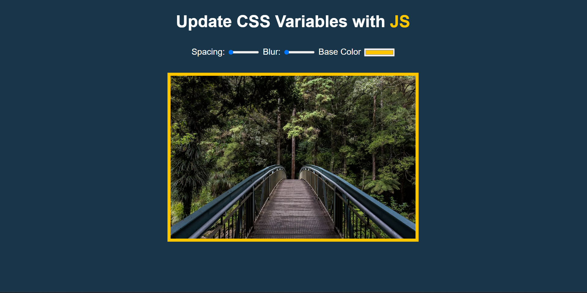

<h1 align="center">CSS Variables Playground</h1>

Projeto desenvolvido através do desafio 🟡JS 30 dias  

  <a href="#-tecnologias">Tecnologias</a>&nbsp;&nbsp;&nbsp;|&nbsp;&nbsp;&nbsp;
  <a href="#-projeto">Projeto</a>&nbsp;&nbsp;&nbsp;|&nbsp;&nbsp;&nbsp;
  <a href="#-licença">Licença</a>

  

  <a href="https://3-css-variables-taupe.vercel.app/" target="_blank">→ Confira o projeto!🔴</a>

 

## 🚀 Tecnologias

Esse projeto foi desenvolvido com as seguintes tecnologias:

-   HTML e CSS
-   JavaScript
-   Git e Github

## 💻 Projeto

D
O CSS Variables Playground é um projeto focado para manipular através do JS variáveis CSS produzindo um efeito visual instântaneo e divertido de se utilizar.

## 🔘 Licença

Esse projeto está sob a licença MIT.

---
